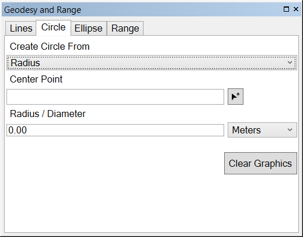

# geodesy-and-range-addin-dotnet

Add-in provides the ability to create geodesic features such as lines, circles, ellipses and range rings.

 

## Features

* Creates geodesy lines, circles, ellipses and range rings.
* Inputs can be entered manually or via a known coordinate 
* Addin for ArcMap 10.3.1

## Sections

* [Requirements](#requirements)
* [Instructions](#instructions)
* [Usage](#usage)
* [Resources](#resources)
* [Issues](#issues)
* [Contributing](#contributing)
* [Licensing](#licensing)

## Requirements

### Devs

* Visual Studio 2013
* ArcGIS Desktop SDK for .NET 10.3.1
	* [ArcGIS Desktop for .NET Requirements](https://desktop.arcgis.com/en/desktop/latest/get-started/system-requirements/arcobjects-sdk-system-requirements.htm)

### Desktop Users

* ArcGIS Desktop 10.3.1
* [ArcGIS Desktop for .NET Requirements](http://desktop.arcgis.com/en/arcmap/10.3/get-started/system-requirements/arcgis-desktop-system-requirements.htm)
* 
## Getting Started

###New to Github

* [New to Github? Get started here.](http://htmlpreview.github.com/?https://github.com/Esri/esri.github.com/blob/master/help/esri-getting-to-know-github.html)

### Working with the Add-In

## Devs

* Building
	* To Build Using Visual Studio
		* Open and build solution file
	* To use MSBuild to build the solution
		* Open a Visual Studio Command Prompt: Start Menu | Visual Studio 2013 | Visual Studio Tools | Developer Command Prompt for VS2013
		* ``` cd geodesy-and-range-addin-dotnet\source\GeodesyAndRange\ArcMapAddinGeodesyAndRange ```
		* ``` msbuild ArcMapAddinGeodesyAndRange.sln /property:Configuration=Release ```
	* Note : Assembly references are based on a default install of the SDK, you may have to update the references if you chose an alternate install option

## Users
* Running
	* To run from a stand-alone deployment
		* ArcMap
			* Install the add-in from the application folder by double clicking the add-in
			* Add the add-in command to a toolbar via menu option 
				* "Customize -> Customize mode"
				* Select "Commands" Tab
				* Select "Add-In Controls"
				* Drag/Drop "Show Geodesy and Range" command onto a toolbar
				* Close customize mode
				* Open tool by clicking the "Show Geodesy and Range" command you just added
				* Dockable geodesy and range tool appears
				* If you add this to a toolbar that you contstantly use the add-in will stay to get remove the add-in delete your Normal.MXT file [Delete your Normal.MXT file](https://geonet.esri.com/thread/78692)
				
## Workflows

### Create Lines Interactively 
	* Choose the Lines tab on the Geodesy and Range Tool
	* Choose the type of line that is needed to be created
	* Start an interactive session by selecting the arrow icon 
	* Enter a starting and ending point on the map by clicking on the map
	* Repeat until all desired graphics have been included

### Create Lines from Known Coordinates
	* Choose the type of line that is needed to be created
	* Input the first coordinate of where your line is going to start
	* Input the second coordinate of where your line is going to end
	* Press "Enter" key and the graphic will be drawn on the map
	* Repeat until all desired graphics have been included. 

### Create a Line with a Range and Bearing
	* Choose the type of line that you would like the create
	* Choose Bearing and Distance from the second drop down menu
	* Input the length of the line and choose the unit type
	* Input the azimuth or angle of the line
	* Press "Enter" key and the graphic will be drawn on the map

### Create a Circle Interactively 
	* Choose the Circles tab on the Geodesy and Range Tool
	* Start an interactive session by selecting the arrow icon 
	* Enter a starting point and the distance of the circles radius by clicking on the map
	* A graphic will then be displayed on the map showing the circle you created
	* If desired you can clear all graphics with the clear graphics button

### Create Range Rings Interactively 
	* Choose the Range Rings tab on the Geodesy and Range Tool
	* Start an interactive session by selecting the arrow icon next to the “Center Point” text box
	* Choose the location of the Range Rings center by selecting the desired location on the map
	* Fill in the associated parameters for “Number of Rings”, “Ring Interval”, “Distance Units”, and “Number of Radials”
	* Press "Enter" key
	* Graphic(s) will then be displayed on the map showing the Range Rings you created based on the values of the parameters that were set

### Create Range Rings Manually 
	* Choose the Range Rings tab on the Geodesy and Range Tool
	* Fill in the associated parameters for “Number of Rings”, “Ring Interval”, “Distance Units”, and “Number of Radials”
	* Input the coordinates for the Range Rings center in the “Center Point” text box and select the Enter key on the keyboard
	* Graphic(s) will then be displayed on the map showing the Range Rings you created based on the values of the parameters that were set
	* If desired you can clear all graphics with the clear graphics button

## Resources

* [ArcGIS 10.3 Help](http://resources.arcgis.com/en/help/)
* [ArcGIS Blog](http://blogs.esri.com/esri/arcgis/)
* [@EsriDefense](http://twitter.com/EsriDefense)
* [ArcGIS Solutions Website](http://solutions.arcgis.com/military/)

## Issues

Find a bug or want to request a new feature?  Please let us know by submitting an [issue](https://github.com/ArcGIS/geodesy-and-range-addin-dotnet/issues).

## Contributing

Anyone and everyone is welcome to contribute. Please see our [guidelines for contributing](https://github.com/esri/contributing).

### Repository Points of Contact

#### Repository Owner: [Joe](https://github.com/jmccausland)

* Merge Pull Requests
* Creates Releases and Tags
* Manages Milestones
* Manages and Assigns Issues

#### Secondary: TBD

* Backup when the Owner is away

## Licensing

Copyright 2016 Esri

Licensed under the Apache License, Version 2.0 (the "License");
you may not use this file except in compliance with the License.
You may obtain a copy of the License at

   http://www.apache.org/licenses/LICENSE-2.0

Unless required by applicable law or agreed to in writing, software
distributed under the License is distributed on an "AS IS" BASIS,
WITHOUT WARRANTIES OR CONDITIONS OF ANY KIND, either express or implied.
See the License for the specific language governing permissions and
limitations under the License.

A copy of the license is available in the repository's [license.txt](license.txt) file.

[](Esri Tags: Military Analyst Defense ArcGIS ArcObjects .NET WPF ArcGISSolutions ArcMap ArcPro Add-In)
[](Esri Language: C#) 
