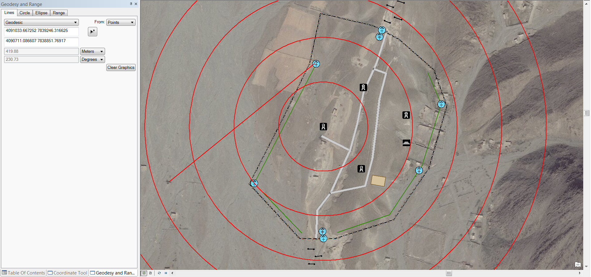

# geodesy-and-range-addin-dotnet

Add-in provides the ability to easily and quickly create geodesy lines, circles, ellipses and range rings.

 

## Features

* Creates geodesy lines, circles, ellipses and range rings.
* Inputs can be entered manually or via a map point tool
* Addin for ArcMap 10.3.1

## Sections

* [Requirements](#requirements)
* [Instructions](#instructions)
* [Resources](#resources)
* [Issues](#issues)
* [Contributing](#contributing)
* [Licensing](#licensing)

## Requirements

### Devs

* Visual Studio 2013
* ArcGIS Desktop SDK for .NET 10.3.1
	* [ArcGIS Desktop for .NET Requirements](https://desktop.arcgis.com/en/desktop/latest/get-started/system-requirements/arcobjects-sdk-system-requirements.htm)

### Users

* ArcGIS Desktop 10.3.1

## Instructions

### General Help

* [New to Github? Get started here.](http://htmlpreview.github.com/?https://github.com/Esri/esri.github.com/blob/master/help/esri-getting-to-know-github.html)

### Getting Started with the Geodesy and Range Addin (.NET)

## Devs

* Building
	* To Build Using Visual Studio
		* Open and build solution file
	* To use MSBuild to build the solution
		* Open a Visual Studio Command Prompt: Start Menu | Visual Studio 2013 | Visual Studio Tools | Developer Command Prompt for VS2013
		* ``` cd geodesy-and-range-addin-dotnet\source\GeodesyAndRange\ArcMapAddinGeodesyAndRange ```
		* ``` msbuild ArcMapAddinGeodesyAndRange.sln /property:Configuration=Release ```
	* Note : Assembly references are based on a default install of the SDK, you may have to update the references if you chose an alternate install option

## Users
* Running
	* To run from a stand-alone deployment
		* ArcMap
			* Install the add-in from the application folder by double clicking it
			* Add the add-in command to a toolbar via menu option 
				* "Customize -> Customize mode"
				* Select "Commands" Tab
				* Select "Add-In Controls"
				* Drag/Drop "Show Geodesy and Range" command onto a toolbar
				* Close customize mode
				* Open tool by clicking the "Show Geodesy and Range" command you just added
				* Dockable geodesy and range tool appears
				
## Resources

* [ArcGIS 10.3 Help](http://resources.arcgis.com/en/help/)
* [ArcGIS Blog](http://blogs.esri.com/esri/arcgis/)
* [@EsriDefense](http://twitter.com/EsriDefense)
* [ArcGIS Solutions Website](http://solutions.arcgis.com/military/)

## Issues

Find a bug or want to request a new feature?  Please let us know by submitting an [issue](https://github.com/ArcGIS/geodesy-and-range-addin-dotnet/issues).

## Contributing

Anyone and everyone is welcome to contribute. Please see our [guidelines for contributing](https://github.com/esri/contributing).

### Repository Points of Contact

#### Repository Owner: [Joe](https://github.com/jmccausland)

* Merge Pull Requests
* Creates Releases and Tags
* Manages Milestones
* Manages and Assigns Issues

#### Secondary: TBD

* Backup when the Owner is away

## Licensing

Copyright 2016 Esri

Licensed under the Apache License, Version 2.0 (the "License");
you may not use this file except in compliance with the License.
You may obtain a copy of the License at

   http://www.apache.org/licenses/LICENSE-2.0

Unless required by applicable law or agreed to in writing, software
distributed under the License is distributed on an "AS IS" BASIS,
WITHOUT WARRANTIES OR CONDITIONS OF ANY KIND, either express or implied.
See the License for the specific language governing permissions and
limitations under the License.

A copy of the license is available in the repository's [license.txt](license.txt) file.

[](Esri Tags: Military Analyst Defense ArcGIS ArcObjects .NET WPF ArcGISSolutions ArcMap ArcPro Add-In)
[](Esri Language: C#) 
