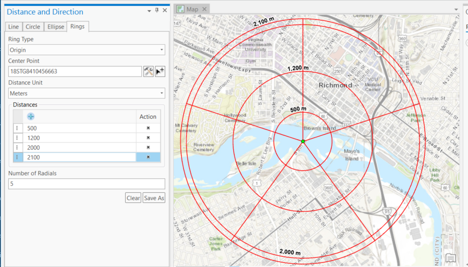

# Distance and Direction
___Beginning at ArcGIS Pro 2.6 this functionality is installed with ArcGIS Pro. This repository will only be updated with critical fixes to ArcGIS Desktop.___

The Distance and Direction component provides the ability to create geodesic features such as lines, circles, ellipses and range rings.

 

## Features

* Creates geodesy lines, circles, ellipses and range rings.
* Inputs can be entered manually or via a known coordinate.
* Add-ins for ArcMap and ArcGIS Pro 

## Sections

* [Requirements](#requirements)
* [Instructions](#instructions)
* [Resources](#resources)
* [New to Github?](#new-to-github)
* [Issues](#issues)
* [Contributing](#contributing)
* [Repository Points of Contact](#repository-points-of-contact)
* [Licensing](#licensing)

## Requirements

### Build Requirements 

* Visual Studio 2015
    * Important Note: Visual Studio 2013 [may also be required if building on ArcGIS 10.4.1-10.5.1](https://support.esri.com/en/technical-article/000012659)
* ArcGIS for Desktop 
	* ArcMap 10.4.1+
	* ArcGIS Pro 2.2+
* ArcGIS Desktop SDK for .NET 10.4.1+
	* [ArcGIS Desktop for .NET Requirements](https://desktop.arcgis.com/en/desktop/latest/get-started/system-requirements/arcobjects-sdk-system-requirements.htm)
* [ArcGIS Pro SDK](http://pro.arcgis.com/en/pro-app/sdk/) 2.2+

### Run Requirements

* ArcGIS for Desktop 
	* ArcMap 10.4.1+
	* ArcGIS Pro 2.2+

## Instructions

Follow the links below to select the desired development/deployment environment.

### Add-ins for ArcMap and ArcGIS Pro 

[Instructions for the Add-ins for ArcMap and ArcGIS Pro are here.](./source/addins)

## Resources

* [ArcGIS for Defense Distance and Direction Component](http://solutions.arcgis.com/defense/help/distance-direction/)
* [Military Tools for ArcGIS](https://esri.github.io/military-tools-desktop-addins/)
* [Military Tools for ArcGIS Solutions Pages](http://solutions.arcgis.com/defense/help/military-tools/)
* [ArcGIS for Defense Downloads](http://appsforms.esri.com/products/download/#ArcGIS_for_Defense)
* [ArcGIS Blog](http://blogs.esri.com/esri/arcgis/)
* [ArcGIS Solutions Website](http://solutions.arcgis.com/military/)

## New to Github

* [New to Github? Get started here.](https://github.com/Esri/esri.github.com/blob/master/help/esri-getting-to-know-github.html)

## Issues

Find a bug or want to request a new feature?  Please let us know by submitting an [issue](https://github.com/ArcGIS/distance-and-direction-addin-dotnet/issues).

## Contributing

Anyone and everyone is welcome to contribute. Please see our [guidelines for contributing](https://github.com/esri/contributing).

## Repository Points of Contact 
Contact the [Military Tools team](mailto:defensesolutions@esri.com)

## Licensing
Copyright 2018 Esri

Licensed under the Apache License, Version 2.0 (the "License");
you may not use this file except in compliance with the License.
You may obtain a copy of the License at:

   http://www.apache.org/licenses/LICENSE-2.0.

Unless required by applicable law or agreed to in writing, software
distributed under the License is distributed on an "AS IS" BASIS,
WITHOUT WARRANTIES OR CONDITIONS OF ANY KIND, either express or implied.
See the License for the specific language governing permissions and
limitations under the License.

A copy of the license is available in the repository's [license.txt](./License.txt) file.

